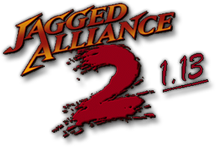

# Jagged Alliance 2 v1.13 Documentation

  

**Jagged Alliance 2 v1.13** (usually just *1.13*) is the community-driven overhaul of
*Jagged Alliance 2*: hundreds of new features, weapons and options built on top of the
original game, with nearly all game data externalized so you can tweak — or completely
mod — almost anything.

This site is the central place for 1.13 documentation: how to install and play it, how to
configure it, and how to mod and develop it. It replaces the scattered older sources
(the pbworks wiki, SVN text files and forum threads), which are linked from each page
where they remain useful — and unlike those sources, the mechanics described here are
verified against the current game data and source code, with each page listing exactly
what it was checked against.

-   :material-rocket-launch:{ .lg .middle } **Getting started**

    ---

    What 1.13 is, how to install it on top of Jagged Alliance 2, and how to fix
    common problems on modern Windows.

    [:octicons-arrow-right-24: Start here](getting-started/index.md)

-   :material-gamepad-variant:{ .lg .middle } **Playing the game**

    ---

    New game options, the complete hotkey reference, and guides to the big new
    systems: NCTH, the new inventory, attachments, militia and more.

    [:octicons-arrow-right-24: Play guide](playing/index.md)

-   :material-map-search:{ .lg .middle } **Walkthrough**

    ---

    A beginner-friendly walkthrough of the whole campaign: every town, quest and
    recruitable character. **Contains spoilers!**

    [:octicons-arrow-right-24: Walkthrough](walkthrough/index.md)

-   :material-tune:{ .lg .middle } **Configuration**

    ---

    1.13 is famously customizable. Learn your way around `ja2.ini`,
    `JA2_Options.ini` and the XML data files.

    [:octicons-arrow-right-24: Configuration](configuration/index.md)

-   :material-hammer-wrench:{ .lg .middle } **Modding**

    ---

    Build your own mod on the 1.13 platform: the Virtual File System, XML
    modding, the Map Editor, custom faces and Lua scripting.

    [:octicons-arrow-right-24: Modding](modding/index.md)

-   :material-code-braces:{ .lg .middle } **Development**

    ---

    Get the source, build the game with Visual Studio and CMake, and learn how
    the codebase is organized.

    [:octicons-arrow-right-24: Development](development/index.md)

## Quick links

- :material-download: **[Download the latest release](https://github.com/1dot13/source/releases)** — all-in-one packages that include 1.13, the Map Editor and Unfinished Business support
- :material-github: **[The 1.13 project on GitHub](https://github.com/1dot13)** — source code, game data and tools
- :material-forum: **[The Bear's Pit forums](https://thepit.ja-galaxy-forum.com)** — the home of the 1.13 community since 2004
- :fontawesome-brands-discord: **[The Bear's Pit Discord](https://discord.gg/GqrVZUM)** — where development discussion happens today

## Contributing

This documentation lives on [GitHub](https://github.com/1dot13/documentation) and every
page has an edit button (:material-pencil:) in the top right corner. Corrections and new
content are very welcome — see [Contributing](development/contributing.md).
